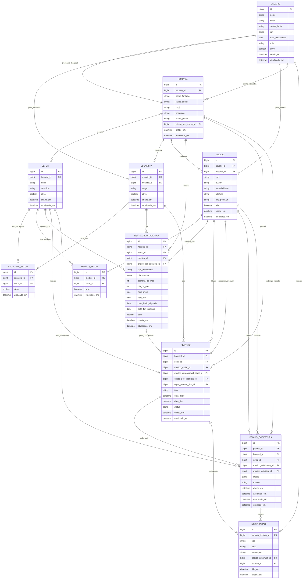

# DER - Medical Shift Schedule

## Leitura rapida do diagrama

- `MEDICO_SETOR` e a tabela que garante que um medico so veja pedidos de cobertura dos setores aos quais esta vinculado.
- `ESCALISTA_SETOR` limita em quais setores o escalista pode criar escalas e vincular medicos.
- `REGRA_PLANTAO_FIXO` representa a recorrencia; `PLANTAO` representa cada ocorrencia concreta.
- `PEDIDO_COBERTURA` representa a oferta aberta no calendario dos medicos elegiveis do mesmo hospital e setor.
- O campo `medico_cobridor_id` fica nulo enquanto o pedido esta aberto e recebe o medico que assumiu a cobertura.
- `NOTIFICACAO` registra o aviso ao medico solicitante quando outro medico assume a cobertura.
