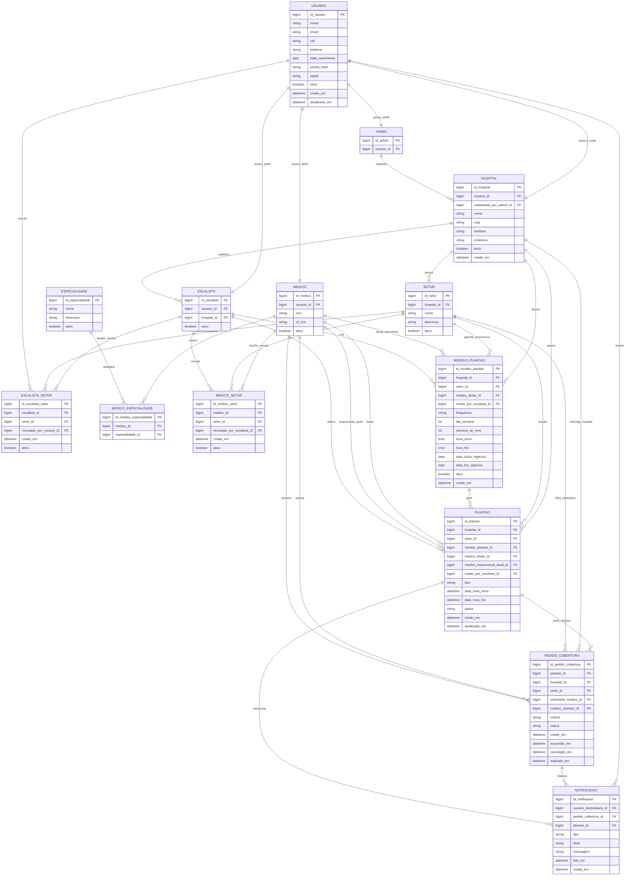

# DER proposto em Mermaid

```mermaid
erDiagram
    USUARIO {
        bigint id_usuario PK
        string nome
        string email
        string cpf
        string telefone
        date data_nascimento
        string senha_hash
        string papel
        boolean ativo
        datetime criado_em
        datetime atualizado_em
    }

    ADMIN {
        bigint id_admin PK
        bigint usuario_id FK
    }

    HOSPITAL {
        bigint id_hospital PK
        bigint usuario_id FK
        bigint cadastrado_por_admin_id FK
        string nome
        string cnpj
        string telefone
        string endereco
        boolean ativo
        datetime criado_em
    }

    SETOR {
        bigint id_setor PK
        bigint hospital_id FK
        string nome
        string descricao
        boolean ativo
    }

    ESCALISTA {
        bigint id_escalista PK
        bigint usuario_id FK
        bigint hospital_id FK
        boolean ativo
    }

    ESCALISTA_SETOR {
        bigint id_escalista_setor PK
        bigint escalista_id FK
        bigint setor_id FK
        bigint vinculado_por_usuario_id FK
        datetime criado_em
        boolean ativo
    }

    MEDICO {
        bigint id_medico PK
        bigint usuario_id FK
        string crm
        string uf_crm
        boolean ativo
    }

    ESPECIALIDADE {
        bigint id_especialidade PK
        string nome
        string descricao
        boolean ativo
    }

    MEDICO_ESPECIALIDADE {
        bigint id_medico_especialidade PK
        bigint medico_id FK
        bigint especialidade_id FK
    }

    MEDICO_SETOR {
        bigint id_medico_setor PK
        bigint medico_id FK
        bigint setor_id FK
        bigint vinculado_por_escalista_id FK
        datetime criado_em
        boolean ativo
    }

    MODELO_PLANTAO {
        bigint id_modelo_plantao PK
        bigint hospital_id FK
        bigint setor_id FK
        bigint medico_titular_id FK
        bigint criado_por_escalista_id FK
        string frequencia
        int dia_semana
        int semana_do_mes
        time hora_inicio
        time hora_fim
        date data_inicio_vigencia
        date data_fim_vigencia
        boolean ativo
        datetime criado_em
    }

    PLANTAO {
        bigint id_plantao PK
        bigint hospital_id FK
        bigint setor_id FK
        bigint modelo_plantao_id FK
        bigint medico_titular_id FK
        bigint medico_responsavel_atual_id FK
        bigint criado_por_escalista_id FK
        string tipo
        datetime data_hora_inicio
        datetime data_hora_fim
        string status
        datetime criado_em
        datetime atualizado_em
    }

    PEDIDO_COBERTURA {
        bigint id_pedido_cobertura PK
        bigint plantao_id FK
        bigint hospital_id FK
        bigint setor_id FK
        bigint solicitante_medico_id FK
        bigint medico_cobridor_id FK
        string motivo
        string status
        datetime criado_em
        datetime assumido_em
        datetime cancelado_em
        datetime expirado_em
    }

    NOTIFICACAO {
        bigint id_notificacao PK
        bigint usuario_destinatario_id FK
        bigint pedido_cobertura_id FK
        bigint plantao_id FK
        string tipo
        string titulo
        string mensagem
        datetime lida_em
        datetime criada_em
    }

    USUARIO ||--|| ADMIN : possui_perfil
    USUARIO ||--|| HOSPITAL : possui_conta
    USUARIO ||--|| ESCALISTA : possui_perfil
    USUARIO ||--|| MEDICO : possui_perfil

    ADMIN ||--o{ HOSPITAL : cadastra
    HOSPITAL ||--o{ SETOR : possui
    HOSPITAL ||--o{ ESCALISTA : cadastra

    ESCALISTA ||--o{ ESCALISTA_SETOR : recebe_vinculo
    SETOR ||--o{ ESCALISTA_SETOR : permite_escalista
    USUARIO ||--o{ ESCALISTA_SETOR : vincula

    MEDICO ||--o{ MEDICO_SETOR : recebe_vinculo
    SETOR ||--o{ MEDICO_SETOR : permite_medico
    ESCALISTA ||--o{ MEDICO_SETOR : vincula

    MEDICO ||--o{ MEDICO_ESPECIALIDADE : possui
    ESPECIALIDADE ||--o{ MEDICO_ESPECIALIDADE : classifica

    HOSPITAL ||--o{ MODELO_PLANTAO : possui
    SETOR ||--o{ MODELO_PLANTAO : agenda_recorrencia
    MEDICO ||--o{ MODELO_PLANTAO : titular_recorrente
    ESCALISTA ||--o{ MODELO_PLANTAO : cria

    HOSPITAL ||--o{ PLANTAO : possui
    SETOR ||--o{ PLANTAO : recebe
    MODELO_PLANTAO ||--o{ PLANTAO : gera
    MEDICO ||--o{ PLANTAO : titular
    MEDICO ||--o{ PLANTAO : responsavel_atual
    ESCALISTA ||--o{ PLANTAO : atribui

    PLANTAO ||--o{ PEDIDO_COBERTURA : pode_originar
    HOSPITAL ||--o{ PEDIDO_COBERTURA : restringe_hospital
    SETOR ||--o{ PEDIDO_COBERTURA : filtra_calendario
    MEDICO ||--o{ PEDIDO_COBERTURA : solicita
    MEDICO ||--o{ PEDIDO_COBERTURA : assume

    USUARIO ||--o{ NOTIFICACAO : recebe
    PEDIDO_COBERTURA ||--o{ NOTIFICACAO : dispara
    PLANTAO ||--o{ NOTIFICACAO : referencia
```
