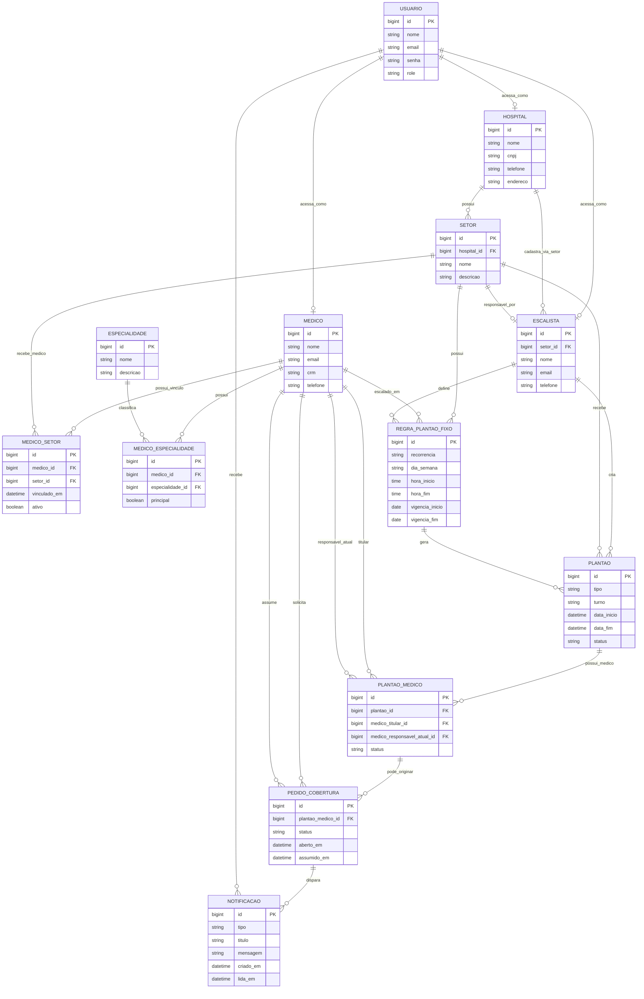

# DER simplificado - MedShift

Este documento apresenta uma versao conceitual e simplificada do DER do MedShift, pensada para apresentacao em banca de TCC.

O objetivo deste diagrama nao e substituir o DER completo, mas comunicar de forma mais clara as entidades principais e como elas se relacionam no dominio de gestao de plantoes medicos.

## Por que usar um DER simplificado?

Sim, e uma boa pratica apresentar uma versao simplificada quando o modelo oficial possui muitas entidades tecnicas, tabelas associativas ou campos de apoio.

Em documentos academicos e apresentacoes, e comum separar:

- DER conceitual: mostra as entidades principais e as regras de negocio mais importantes;
- DER logico/fisico: mostra chaves estrangeiras, tabelas associativas, campos de auditoria, status internos e detalhes de persistencia.

Neste projeto, o DER completo continua sendo importante para implementacao. Ja este DER simplificado e mais adequado para explicar o funcionamento geral do sistema para a banca.

## Diagrama Mermaid

## Leitura do modelo

### Usuario

Representa a conta usada para autenticar no sistema.

Um usuario pode acessar o sistema como hospital, escalista ou medico, conforme seu papel de acesso.

No DER completo, essa decisao permite centralizar login, senha e permissoes em uma unica entidade.

### Hospital

Representa a instituicao hospitalar cadastrada no sistema.

O hospital possui setores e cadastra escalistas. O hospital do escalista e identificado pelo setor ao qual ele esta vinculado. Cada escalista fica responsavel por um unico setor do hospital, e cada setor pode ter no maximo um escalista responsavel.

### Setor

Representa uma area ou unidade operacional do hospital, como UTI, emergencia, pediatria ou centro cirurgico.

O setor e uma entidade central porque limita a atuacao dos escalistas, dos medicos e a visibilidade dos pedidos de cobertura. No modelo atual, um setor pode ter no maximo um escalista responsavel.

### Escalista

Representa o profissional responsavel por montar e administrar escalas.

O escalista atua em um unico setor. Dentro desse setor, ele pode vincular medicos e criar plantoes. Como a relacao com setor e 1:1 funcional, outro escalista nao pode ser responsavel pelo mesmo setor.

### Medico

Representa o profissional que realiza plantoes.

O medico pode estar vinculado a um ou mais setores. Esses vinculos definem:

- em quais setores ele pode receber plantoes;
- quais pedidos de cobertura ele pode visualizar;
- quais plantoes ele pode assumir.

### Medico setor

Representa o vinculo entre medico e setor.

Essa entidade associativa foi mantida no DER simplificado porque e uma regra central do sistema: um medico pode atuar em varios setores, e um setor pode possuir varios medicos.

Esse vinculo define quais plantoes o medico pode receber e quais pedidos de cobertura ele pode visualizar.

### Especialidade

Representa a area de atuacao do medico, como cardiologia, ortopedia ou clinica medica.

### Medico especialidade

Representa o vinculo entre medico e especialidade.

Essa entidade associativa permite que um medico tenha uma ou mais especialidades, e que uma mesma especialidade esteja associada a varios medicos.

O campo `principal` indica a especialidade principal do medico quando houver mais de uma.

### Regra de plantao fixo

Representa a regra de recorrencia de um plantao fixo.

Exemplos:

- todo sabado das 07h as 19h;
- todo segundo sabado do mes;
- toda semana no turno noturno.

Essa entidade nao e o plantao realizado em si. Ela apenas define a regra que gera plantoes concretos.

### Plantao

Representa uma ocorrencia real de plantao, com data, horario e setor.

O plantao pode ser:

- avulso: criado para uma data e horario especificos;
- fixo: gerado a partir de uma regra de recorrencia.

Um plantao pode ter de 1 a 4 atribuicoes medicas individuais. Essas atribuicoes ficam em `PLANTAO_MEDICO`.

### Plantao medico

Representa uma vaga/atribuicao de medico dentro de um plantao.

O medico titular e o medico originalmente escalado naquela atribuicao. O medico responsavel atual pode mudar quando outro medico assume uma cobertura daquela atribuicao.

No MVP, o limite de ate 4 medicos por plantao e uma regra de negocio validada no backend.

### Pedido de cobertura

Representa a solicitacao feita por um medico que deseja passar sua atribuicao em um plantao para outro profissional.

Quando o pedido e aberto, ele fica visivel apenas para medicos vinculados ao mesmo setor do plantao.

Quando outro medico assume a cobertura, o pedido e marcado como assumido e a atribuicao em `PLANTAO_MEDICO` passa a ter esse medico como responsavel atual.

### Notificacao

Representa mensagens internas enviadas aos usuarios.

No fluxo principal do sistema, uma notificacao e enviada ao medico solicitante quando outro medico assume seu pedido de cobertura.

## Simplificacoes em relacao ao DER completo

Este diagrama omite propositalmente alguns detalhes tecnicos para melhorar a clareza:

- tabela associativa `ESCALISTA_SETOR`;
- campos de auditoria, como `criado_em`, `atualizado_em` e `ativo`;
- chaves estrangeiras explicitas em todas as entidades;
- campos legados mantidos por compatibilidade com o codigo;
- campos legados de medico titular/responsavel ainda existentes em `PLANTAO`;
- detalhes internos de controle de status.

Essas simplificacoes nao removem regras importantes do dominio. Elas apenas tornam o DER mais adequado para apresentacao e explicacao conceitual.

## Como apresentar para a banca

Uma forma clara de explicar este DER e seguir esta ordem:

1. O sistema possui usuarios autenticados com diferentes papeis.
2. O hospital cadastra setores e escalistas.
3. Cada escalista responde por um unico setor, e cada setor tem no maximo um escalista responsavel.
4. O medico e vinculado aos setores por meio de `MEDICO_SETOR`.
5. O medico possui especialidades por meio de `MEDICO_ESPECIALIDADE`.
6. O escalista cria plantoes e atribui de 1 a 4 medicos ao mesmo plantao.
7. O medico pode solicitar cobertura da sua atribuicao em um plantao.
8. Apenas medicos do mesmo setor visualizam e podem assumir a cobertura.
9. Quando a cobertura e assumida, o solicitante recebe uma notificacao.

Assim, a banca entende primeiro o fluxo principal do sistema, sem precisar analisar todas as estruturas tecnicas do banco de dados.
