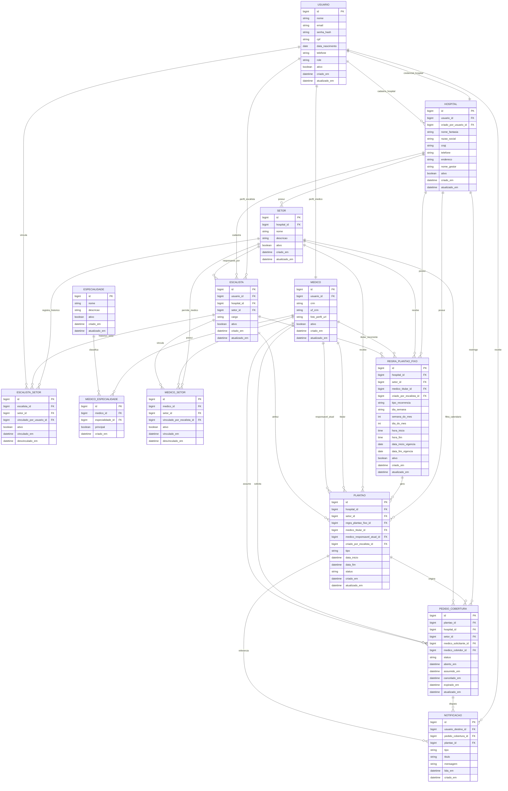

# DER consolidado - MedShift

Este documento e a fonte unica proposta para o DER do MedShift. Ele consolida as versoes anteriores e considera as regras de negocio discutidas:

- o `ADMIN` cadastra hospitais;
- o hospital acessa o sistema com suas credenciais;
- o hospital cadastra setores e escalistas;
- cada escalista fica responsavel por um unico setor do hospital;
- escalistas vinculam medicos ao seu setor e atribuem plantoes;
- plantoes podem ser avulsos ou fixos/recorrentes;
- o medico pode abrir um pedido para outro medico assumir seu plantao;
- pedidos de cobertura aparecem apenas para medicos vinculados ao mesmo hospital e setor;
- quando um medico assume a cobertura, o solicitante recebe uma notificacao;
- check-in e check-out nao fazem parte deste modelo.

## Diagrama Mermaid



## Decisoes de modelagem

### Admin como papel de usuario

Nao ha tabela `ADMIN`. O administrador global e representado por `USUARIO.role = ADMIN`.

Motivo: no dominio atual, o admin nao tem atributos especificos alem dos dados de login e identidade. Se no futuro o admin tiver dados proprios, uma tabela `ADMIN` pode ser criada sem mudar o restante do modelo.

### Hospital com credencial propria

`HOSPITAL.usuario_id` aponta para a conta usada pelo hospital para acessar o sistema.

O campo `HOSPITAL.criado_por_usuario_id` aponta para o `USUARIO` com role `ADMIN` que cadastrou o hospital.

### Medico vinculado a setores

O medico nao deve enxergar pedidos de cobertura por ser "medico do sistema"; ele enxerga porque possui vinculo ativo com setores.

Por isso, `MEDICO_SETOR` e uma entidade central. Ela define onde o medico pode atuar e quais pedidos de cobertura aparecem no calendario dele.

### Plantao fixo separado de plantao concreto

`REGRA_PLANTAO_FIXO` representa a recorrencia, por exemplo:

- todo sabado das 07h as 19h;
- todo segundo sabado do mes das 07h as 19h.

`PLANTAO` representa a ocorrencia concreta em uma data e horario especificos.

Assim, uma regra fixa pode gerar varios plantoes concretos.

### Cobertura como pedido direto

Nao existe tabela de candidatura. O fluxo e direto:

1. O medico responsavel atual abre um `PEDIDO_COBERTURA`.
2. O pedido aparece como marcacao vermelha no calendario dos medicos elegiveis do mesmo hospital e setor.
3. Um medico elegivel clica e assume.
4. O pedido muda de `ABERTO` para `ASSUMIDO`.
5. `PLANTAO.medico_responsavel_atual_id` passa a ser o medico cobridor.
6. O medico solicitante recebe uma `NOTIFICACAO`.

## Entidades e campos

### USUARIO

Armazena identidade e autenticacao.

- `id`: chave primaria.
- `nome`: nome do usuario.
- `email`: email de login; deve ser unico.
- `senha_hash`: senha criptografada.
- `cpf`: documento do usuario; deve ser unico quando informado.
- `data_nascimento`: data de nascimento.
- `telefone`: telefone de contato.
- `role`: papel principal: `ADMIN`, `HOSPITAL`, `ESCALISTA`, `MEDICO`.
- `ativo`: indica se a conta pode acessar o sistema.
- `criado_em`: data de criacao.
- `atualizado_em`: data da ultima alteracao.

### HOSPITAL

Representa a instituicao hospitalar.

- `id`: chave primaria.
- `usuario_id`: FK para `USUARIO`; credencial usada pelo hospital para login.
- `criado_por_usuario_id`: FK para `USUARIO`; admin que cadastrou o hospital.
- `nome_fantasia`: nome comercial.
- `razao_social`: razao social.
- `cnpj`: CNPJ; deve ser unico.
- `telefone`: contato do hospital.
- `endereco`: endereco completo ou normalizado em campos proprios, se necessario.
- `nome_gestor`: nome do responsavel administrativo.
- `ativo`: indica se o hospital esta ativo no sistema.
- `criado_em`: data de criacao.
- `atualizado_em`: data da ultima alteracao.

### SETOR

Representa uma unidade operacional do hospital, como UTI, emergencia ou pediatria.

- `id`: chave primaria.
- `hospital_id`: FK para `HOSPITAL`.
- `nome`: nome do setor.
- `descricao`: descricao opcional.
- `ativo`: indica se o setor esta ativo.
- `criado_em`: data de criacao.
- `atualizado_em`: data da ultima alteracao.

Restricao recomendada:

- `hospital_id + nome` deve ser unico para evitar setores duplicados no mesmo hospital.

### ESCALISTA

Perfil operacional responsavel por montar escalas e vincular medicos a setores.

- `id`: chave primaria.
- `usuario_id`: FK para `USUARIO`.
- `hospital_id`: FK para `HOSPITAL`.
- `setor_id`: FK para `SETOR`; setor unico pelo qual o escalista responde.
- `cargo`: cargo ou funcao interna.
- `ativo`: indica se o escalista esta ativo.
- `criado_em`: data de criacao.
- `atualizado_em`: data da ultima alteracao.

Restricao recomendada:

- o usuario associado deve ter `role = ESCALISTA`.
- o setor informado deve pertencer ao mesmo hospital do escalista.
- o escalista deve possuir exatamente um setor responsavel enquanto estiver ativo.

### ESCALISTA_SETOR

Tabela de historico/compatibilidade dos vinculos entre escalistas e setores.

No modelo de negocio atual, ela nao representa mais uma relacao N:N funcional. O setor vigente do escalista e definido por `ESCALISTA.setor_id`. Esta tabela pode registrar o historico de trocas e manter compatibilidade com endpoints existentes.

- `id`: chave primaria.
- `escalista_id`: FK para `ESCALISTA`.
- `setor_id`: FK para `SETOR`.
- `vinculado_por_usuario_id`: FK para `USUARIO`; normalmente o usuario do hospital que fez o vinculo.
- `ativo`: indica se o vinculo ainda vale.
- `vinculado_em`: data em que o vinculo foi criado.
- `desvinculado_em`: data em que o vinculo foi encerrado.

Regras:

- o setor deve pertencer ao mesmo hospital do escalista;
- um escalista so pode ter um vinculo ativo por vez;
- o vinculo ativo deve corresponder ao `ESCALISTA.setor_id`;
- quando o escalista troca de setor, os vinculos ativos anteriores devem ser encerrados.

### MEDICO

Perfil profissional do medico.

- `id`: chave primaria.
- `usuario_id`: FK para `USUARIO`.
- `crm`: numero do CRM.
- `uf_crm`: UF do CRM.
- `foto_perfil_url`: URL da foto de perfil.
- `ativo`: indica se o medico esta ativo.
- `criado_em`: data de criacao.
- `atualizado_em`: data da ultima alteracao.

Restricoes recomendadas:

- `crm + uf_crm` deve ser unico;
- o usuario associado deve ter `role = MEDICO`.

Observacao: o hospital/setor em que o medico atua e definido por `MEDICO_SETOR`, nao por um campo fixo dentro de `MEDICO`.

### ESPECIALIDADE

Catalogo de especialidades medicas.

- `id`: chave primaria.
- `nome`: nome da especialidade.
- `descricao`: descricao opcional.
- `ativo`: indica se a especialidade esta disponivel.
- `criado_em`: data de criacao.
- `atualizado_em`: data da ultima alteracao.

Restricao recomendada:

- `nome` deve ser unico.

### MEDICO_ESPECIALIDADE

Tabela associativa entre medicos e especialidades.

- `id`: chave primaria.
- `medico_id`: FK para `MEDICO`.
- `especialidade_id`: FK para `ESPECIALIDADE`.
- `principal`: indica se e a especialidade principal do medico.
- `criado_em`: data de criacao do vinculo.

Restricao recomendada:

- `medico_id + especialidade_id` deve ser unico.

### MEDICO_SETOR

Tabela associativa que define em quais setores o medico pode atuar.

- `id`: chave primaria.
- `medico_id`: FK para `MEDICO`.
- `setor_id`: FK para `SETOR`.
- `vinculado_por_escalista_id`: FK para `ESCALISTA`; escalista que fez o vinculo.
- `ativo`: indica se o vinculo esta ativo.
- `vinculado_em`: data de criacao do vinculo.
- `desvinculado_em`: data de encerramento do vinculo.

Regras:

- o escalista que vincula o medico deve ser responsavel pelo mesmo setor;
- o medico so visualiza pedidos de cobertura de setores em que possui `MEDICO_SETOR.ativo = true`;
- o medico so pode assumir cobertura em setor em que possui vinculo ativo;
- `medico_id + setor_id` deve ser unico para vinculos ativos.

### REGRA_PLANTAO_FIXO

Representa a regra recorrente de um plantao fixo.

- `id`: chave primaria.
- `hospital_id`: FK para `HOSPITAL`; copia o hospital do setor para facilitar filtros.
- `setor_id`: FK para `SETOR`.
- `medico_titular_id`: FK para `MEDICO`; medico originalmente escalado na recorrencia.
- `criado_por_escalista_id`: FK para `ESCALISTA`.
- `tipo_recorrencia`: tipo da regra: `SEMANAL`, `MENSAL_N_ESIMO_DIA_SEMANA`, `MENSAL_DIA_FIXO`.
- `dia_semana`: dia da semana, quando aplicavel.
- `semana_do_mes`: exemplo `2` para segundo sabado do mes.
- `dia_do_mes`: dia fixo do mes, quando aplicavel.
- `hora_inicio`: horario de inicio.
- `hora_fim`: horario de fim.
- `data_inicio_vigencia`: inicio da validade da regra.
- `data_fim_vigencia`: fim da validade da regra; pode ser nulo.
- `ativo`: indica se a regra continua gerando plantoes.
- `criado_em`: data de criacao.
- `atualizado_em`: data da ultima alteracao.

Regras:

- o setor deve pertencer ao hospital informado;
- o escalista deve ser responsavel pelo setor;
- o medico titular deve ter vinculo ativo com o setor;
- a regra nao substitui a tabela `PLANTAO`; ela gera ou referencia ocorrencias concretas.

### PLANTAO

Representa uma ocorrencia concreta de plantao em data e horario especificos.

- `id`: chave primaria.
- `hospital_id`: FK para `HOSPITAL`; copia o hospital do setor para facilitar filtros.
- `setor_id`: FK para `SETOR`.
- `regra_plantao_fixo_id`: FK para `REGRA_PLANTAO_FIXO`; nulo para plantao avulso.
- `medico_titular_id`: FK para `MEDICO`; medico originalmente escalado.
- `medico_responsavel_atual_id`: FK para `MEDICO`; medico que esta responsavel pelo plantao no momento.
- `criado_por_escalista_id`: FK para `ESCALISTA`.
- `tipo`: `FIXO` ou `AVULSO`.
- `data_inicio`: data e hora de inicio.
- `data_fim`: data e hora de fim.
- `status`: `AGENDADO`, `CANCELADO`, `REALIZADO`.
- `criado_em`: data de criacao.
- `atualizado_em`: data da ultima alteracao.

Regras:

- na criacao, `medico_responsavel_atual_id` deve ser igual a `medico_titular_id`;
- plantao avulso deve ter `regra_plantao_fixo_id = null`;
- plantao fixo deve ter `regra_plantao_fixo_id` preenchido;
- cobertura nao deve apagar o titular original;
- quando uma cobertura e assumida, apenas `medico_responsavel_atual_id` muda.

### PEDIDO_COBERTURA

Representa o pedido aberto por um medico para passar um plantao a outro medico elegivel.

- `id`: chave primaria.
- `plantao_id`: FK para `PLANTAO`.
- `hospital_id`: FK para `HOSPITAL`; copia o hospital do plantao para filtros.
- `setor_id`: FK para `SETOR`; copia o setor do plantao para filtros.
- `medico_solicitante_id`: FK para `MEDICO`; medico que abriu o pedido.
- `medico_cobridor_id`: FK para `MEDICO`; medico que assumiu, nulo enquanto estiver aberto.
- `status`: `ABERTO`, `ASSUMIDO`, `CANCELADO`, `EXPIRADO`.
- `aberto_em`: data de abertura.
- `assumido_em`: data em que outro medico assumiu.
- `cancelado_em`: data de cancelamento pelo solicitante ou sistema.
- `expirado_em`: data de expiracao.
- `atualizado_em`: data da ultima alteracao.

Regras:

- apenas o medico responsavel atual pelo plantao pode abrir o pedido;
- deve existir no maximo um pedido `ABERTO` por plantao;
- pedidos `ABERTO` aparecem no calendario como marcacao vermelha;
- a marcacao vermelha e derivada de `PEDIDO_COBERTURA.status = ABERTO`, nao precisa ser um campo no banco;
- o pedido so aparece para medicos com vinculo ativo no mesmo setor do plantao;
- o medico solicitante nao pode assumir o proprio pedido;
- para assumir, o medico cobridor precisa estar ativo e vinculado ao mesmo setor;
- ao assumir:
  - `PEDIDO_COBERTURA.status` muda para `ASSUMIDO`;
  - `PEDIDO_COBERTURA.medico_cobridor_id` recebe o medico que assumiu;
  - `PEDIDO_COBERTURA.assumido_em` e preenchido;
  - `PLANTAO.medico_responsavel_atual_id` passa a ser o medico cobridor;
  - uma notificacao e criada para o solicitante;
- a operacao de assumir deve ser atomica e condicionar a atualizacao a `status = ABERTO`, evitando que dois medicos assumam o mesmo plantao.

### NOTIFICACAO

Registra avisos entregues aos usuarios.

- `id`: chave primaria.
- `usuario_destino_id`: FK para `USUARIO`; destinatario da notificacao.
- `pedido_cobertura_id`: FK para `PEDIDO_COBERTURA`; nulo quando a notificacao nao for sobre cobertura.
- `plantao_id`: FK para `PLANTAO`; nulo quando nao se aplicar.
- `tipo`: tipo do evento, por exemplo `COBERTURA_ASSUMIDA`, `PLANTAO_ATRIBUIDO`, `PLANTAO_CANCELADO`.
- `titulo`: titulo curto.
- `mensagem`: conteudo da notificacao.
- `lida_em`: data em que o usuario leu; nulo enquanto nao lida.
- `criado_em`: data de criacao.

Regra:

- quando um medico assume uma cobertura, o usuario do medico solicitante recebe uma notificacao `COBERTURA_ASSUMIDA`.

## Relacionamentos resumidos

- `USUARIO 1:1 HOSPITAL` como credencial do hospital.
- `USUARIO 1:N HOSPITAL` como admin que cadastra hospitais.
- `HOSPITAL 1:N SETOR`.
- `HOSPITAL 1:N ESCALISTA`.
- `SETOR 1:N ESCALISTA`; cada escalista responde por um unico setor.
- `ESCALISTA_SETOR` registra historico/compatibilidade dos vinculos do escalista.
- `MEDICO N:N SETOR` via `MEDICO_SETOR`.
- `MEDICO N:N ESPECIALIDADE` via `MEDICO_ESPECIALIDADE`.
- `SETOR 1:N REGRA_PLANTAO_FIXO`.
- `REGRA_PLANTAO_FIXO 1:N PLANTAO`.
- `SETOR 1:N PLANTAO`.
- `MEDICO 1:N PLANTAO` como titular.
- `MEDICO 1:N PLANTAO` como responsavel atual.
- `PLANTAO 1:N PEDIDO_COBERTURA`, mas apenas um pode estar `ABERTO`.
- `MEDICO 1:N PEDIDO_COBERTURA` como solicitante.
- `MEDICO 1:N PEDIDO_COBERTURA` como cobridor.
- `USUARIO 1:N NOTIFICACAO`.

## Consulta de visibilidade de cobertura

Um medico deve visualizar pedidos de cobertura quando todas as condicoes forem verdadeiras:

- `PEDIDO_COBERTURA.status = ABERTO`;
- `PEDIDO_COBERTURA.setor_id` pertence a um `MEDICO_SETOR` ativo do medico logado;
- o setor pertence ao mesmo hospital do pedido;
- `PEDIDO_COBERTURA.medico_solicitante_id` e diferente do medico logado, caso a interface nao deva mostrar o proprio pedido como assumivel.

Em termos conceituais:

```sql
SELECT pc.*
FROM pedido_cobertura pc
JOIN medico_setor ms ON ms.setor_id = pc.setor_id
JOIN setor s ON s.id = pc.setor_id
WHERE pc.status = 'ABERTO'
  AND ms.medico_id = :medicoLogadoId
  AND ms.ativo = true
  AND s.hospital_id = pc.hospital_id
  AND pc.medico_solicitante_id <> :medicoLogadoId;
```

## Indices e restricoes recomendadas

- `usuario.email` unico.
- `usuario.cpf` unico quando informado.
- `hospital.cnpj` unico.
- `hospital.usuario_id` unico.
- `setor.hospital_id + setor.nome` unico.
- `escalista.usuario_id + escalista.hospital_id` unico.
- `escalista.setor_id` obrigatorio para escalistas ativos.
- `escalista_setor.escalista_id` deve possuir no maximo um vinculo ativo.
- `medico.crm + medico.uf_crm` unico.
- `medico.usuario_id` unico.
- `medico_especialidade.medico_id + medico_especialidade.especialidade_id` unico.
- `medico_setor.medico_id + medico_setor.setor_id` unico para vinculos ativos.
- `regra_plantao_fixo.setor_id + regra_plantao_fixo.medico_titular_id`.
- `plantao.setor_id + plantao.data_inicio`.
- `plantao.medico_responsavel_atual_id + plantao.data_inicio`.
- `pedido_cobertura.plantao_id` unico para pedidos com status `ABERTO`.
- `pedido_cobertura.hospital_id + pedido_cobertura.setor_id + pedido_cobertura.status`.
- `notificacao.usuario_destino_id + notificacao.lida_em`.

## O que foi removido das versoes anteriores

- `CHECK IN/OUT`: removido porque nao faz mais parte do escopo.
- `DELEGACAO PLANTAO`: substituido por `PEDIDO_COBERTURA`, que representa melhor o fluxo real.
- `CANDIDATURA_COBERTURA`: removida porque o produto nao tem fila de candidaturas; qualquer medico elegivel pode assumir diretamente.
- `MODELO_PLANTAO`: padronizado como `REGRA_PLANTAO_FIXO`.
- tabela `ADMIN`: removida; admin e um papel em `USUARIO.role`.
