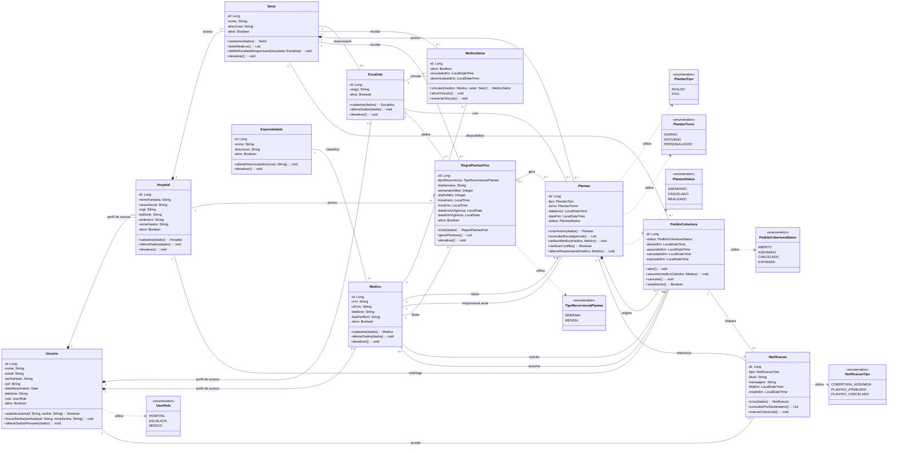

# Diagrama de classes - MedShift

Este diagrama apresenta as classes de dominio do MedShift em uma forma proxima ao modelo logico. Ele prioriza as entidades, os atributos persistidos mais relevantes e as operacoes que definem o papel de cada classe nos principais casos de uso.

Os metodos representam responsabilidades de dominio e ficam na classe cujos dados sao criados, consultados ou alterados, nao no perfil que inicia a acao pela interface. Na implementacao, algumas dessas operacoes podem estar distribuidas entre entidades, services e controllers.

## Notacao UML utilizada

- `--`: associacao entre classes relacionadas.
- `o--`: agregacao. O losango vazio fica do lado do todo, mas a parte ainda pode fazer sentido separadamente.
- `*--`: composicao. O losango preenchido fica do lado do todo, e a parte depende dele para existir no dominio.
- `-`: atributo privado.
- `+`: operacao publica.
- Classes com estereotipo `enumeration` representam conjuntos fechados de valores usados como tipos dos atributos.

## Diagrama Mermaid

## Leitura das relacoes

- `Usuario` compoe os perfis de acesso de `Hospital`, `Escalista` e `Medico`. Os dados de autenticacao ficam centralizados no usuario.
- `Hospital` compoe seus `Setor`es. Um setor pertence a um unico hospital.
- Cada `Setor` possui no maximo um `Escalista` responsavel, e cada escalista atua em um unico setor.
- `MedicoSetor` representa a associacao N:N entre medicos e setores. O escalista responsavel realiza esse vinculo.
- Cada `Medico` possui exatamente uma `Especialidade`. Uma especialidade pode classificar varios medicos.
- Um `Setor` compoe seus `Plantao`es. Cada plantao possui exatamente um medico titular, que tambem e o responsavel atual ate que uma cobertura seja assumida.
- `RegraPlantaoFixo` agrega os plantoes concretos gerados por sua recorrencia. Um plantao ainda representa uma ocorrencia valida mesmo que a regra seja posteriormente desativada.
- Um `Plantao` pode originar pedidos de cobertura. O pedido depende do plantao para existir.
- Um `PedidoCobertura` pode disparar notificacoes. A notificacao informa ao medico solicitante que outro profissional assumiu o plantao.
- Dependencias tracejadas indicam que uma classe utiliza uma enumeracao como tipo de atributo.

## Imagem para apresentacao

A versao diagramada para uso no documento e na apresentacao esta disponivel em:

- `DIAGRAMA-CLASSES-APRESENTACAO.svg`: versao vetorial recomendada para o TCC.
- `DIAGRAMA-CLASSES-APRESENTACAO.png`: versao rasterizada com fundo branco.

As imagens sao geradas por `gerar_diagrama_classes_apresentacao.py`, que preserva as relacoes deste documento e utiliza um layout controlado para melhorar a legibilidade.
