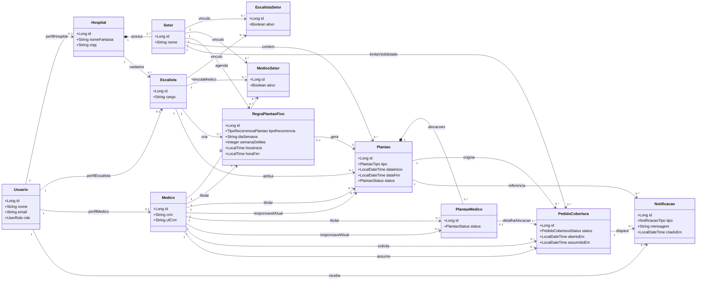

# Diagrama de classes do backend

Versao enxuta do modelo de dominio, focada nos fluxos principais: estrutura hospitalar, vinculos por setor, criacao de plantoes e cobertura entre medicos.

No codigo atual, os conceitos `Escalista` e `Medico` ainda aparecem em algumas classes Java como `Manager` e `Doctor`. Neste diagrama, os nomes foram mantidos em portugues para refletir o dominio mais recente do sistema.

## Leitura rapida

- `Usuario` representa a conta de acesso. Ela pode ter perfil de `Hospital`, `Escalista` ou `Medico`.
- `Hospital` cadastra `Setor` e `Escalista`. O hospital nao cadastra medico diretamente neste fluxo.
- `EscalistaSetor` define em quais setores o escalista atua.
- `MedicoSetor` define em quais setores o medico pode ser visto, escalado e visualizar coberturas.
- `RegraPlantaoFixo` gera ocorrencias de `Plantao`; plantoes avulsos entram diretamente como `Plantao`.
- `PlantaoMedico` representa a alocacao de um medico em um plantao.
- `PedidoCobertura` representa a oferta/aceite de cobertura e gera `Notificacao` para o usuario relacionado.
