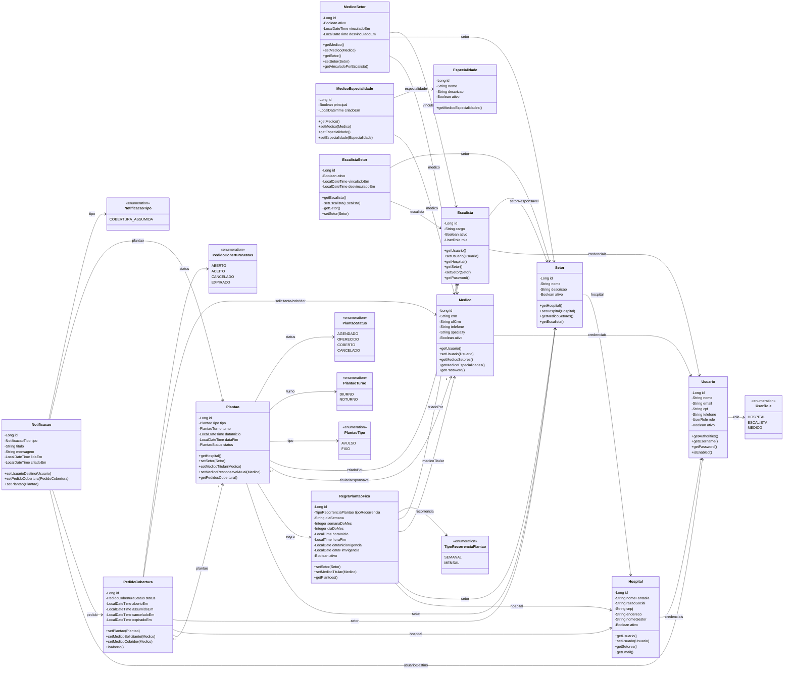

# Diagrama de classes do backend

Versao enxuta do modelo de dominio, focada nos fluxos principais do MVP: autenticacao, estrutura hospitalar, vinculos por setor, criacao de plantoes, recorrencia, cobertura entre medicos e notificacoes.

No codigo atual, os conceitos de dominio `Escalista` e `Medico` aparecem como classes Java `Manager` e `Doctor`. Neste documento, os nomes do dominio foram mantidos para facilitar a leitura da banca.

## Convencao das setas

As setas do diagrama abaixo seguem a referencia do codigo/banco:

- A seta sai da classe que guarda a referencia ou FK.
- A seta aponta para a classe referenciada.
- Exemplo: `Setor --> Hospital` significa que `Setor` pertence a um `Hospital` e guarda essa referencia.
- Relacoes N:N foram representadas por classes associativas, como `MedicoSetor` e `MedicoEspecialidade`.

## Leitura rapida

- `Usuario` e a fonte unica de credenciais, senha, role e permissoes.
- `Hospital`, `Escalista` e `Medico` sao perfis vinculados a `Usuario`.
- `Setor` pertence a um `Hospital`.
- `Escalista` possui um unico `Setor` responsavel. Assim, o hospital do escalista e obtido pelo setor.
- `EscalistaSetor` existe no codigo como historico/compatibilidade de vinculo, mas a regra atual do MVP considera um setor por escalista.
- `MedicoSetor` permite que um medico esteja vinculado a varios setores, inclusive de hospitais diferentes.
- `MedicoEspecialidade` representa a relacao N:N entre medicos e especialidades.
- `RegraPlantaoFixo` define a recorrencia de plantoes fixos e gera registros concretos de `Plantao`.
- `Plantao` representa uma ocorrencia concreta, avulsa ou gerada por regra fixa.
- `PlantaoTurno.fromPeriodo(...)` e usado no codigo para classificar automaticamente o turno como diurno ou noturno.
- Cada `Plantao` possui um unico medico titular. O responsavel atual inicialmente e o titular e pode mudar quando uma cobertura for assumida.
- `PedidoCobertura` representa a oferta de um plantao para outro medico do mesmo setor assumir.
- `Notificacao` registra avisos ao usuario, especialmente quando outro medico assume um pedido de cobertura.
